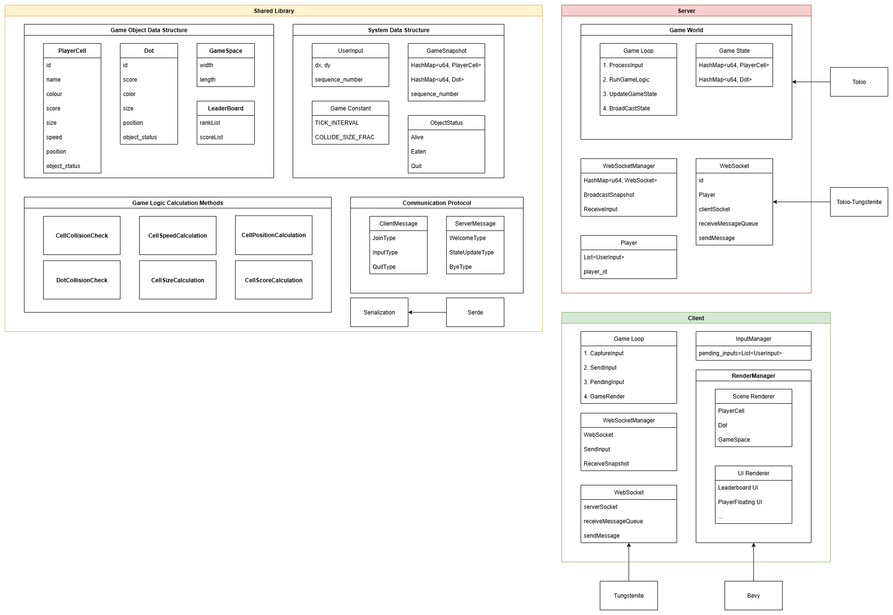
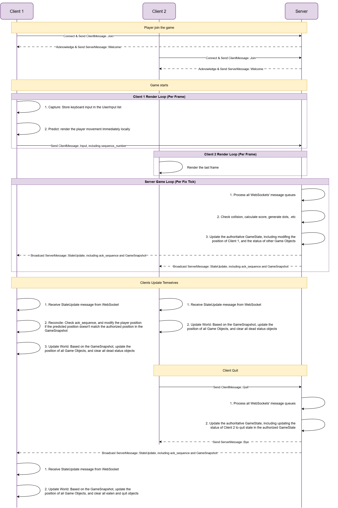

# ECE1724-F1-2025F-Rust-Ball-Ball-U
ECE1724H F1 Special Topics in Software Engineering: Performant Software Systems with Rust 2025 Fall Project

Project Link: [Home Page][home_page]

## Team Members
- [Litao(John) Zhou][github_john] \
  Student Number: 1006013092 \
  Email: litao.zhou@mail.utoronto.ca 
- [Siyu Shao][github_siyu] \
  Student Number: 1007147204 \
  Email: jasmine.shao@mail.utoronto.ca 
- [Chuyue Zhang][github_chuyue] \
  Student Number: 1005728303 \
  Email: zhangchuyue.zhang@mail.utoronto.ca 

### Introduction 

**Ball Ball U** is a real-time multiplayer PvP game inspired by [Battle of Balls][battle_of_balls] and [Agar.io][agar_io], implemented in Rust with a focus on performance, concurrency, and fair competitive gameplay.

### Motivation

Agar.io and Battle of Balls are popular real-time multiplayer games that share the concept that players control balls that grow by consuming smaller balls and scattered food items. Their simple mechanics create deep competitive strategies, making it popular across a wide range of players. 

Our project **Ball Ball U** is inspired by both games, but shifts the focus from PvE-style survival to fast-paced PvP competition. In this version, players directly confront each other, testing both reflexes and strategic decisions such as movement and positioning. This change makes matches more dynamic and competitive, with outcomes driven by player interactions rather than environmental factors. 

We chose Rust because its performance, concurrency model, and memory safety make it well-suited for building a reliable real-time PvP multiplayer game. Although Rust has many existing resources for game development and for backend servers, there are very few complete examples that combine the two into a real-time multiplayer system. Our project helps fill this gap by showing how to connect a Rust game engine with an asynchronous server runtime, providing a clear reference for developers interested in building multiplayer games in Rust.

### Objective and key features

#### Objective

The primary objective of this project is to design and implement a complete, end-to-end, real-time multiplayer game using a pure Rust technology stack.

Inspired by popular titles like Agar.io and Battle of Life, the primary goal is to create a clean, reusable, and well-documented architectural blueprint for client-server interaction within the Rust game development environment.

Our goal is to develop a high-performance, concurrent, and memory-safe multiplayer game server entirely in Rust. This real-time PvP project would include features such as rapid synchronization, consistent state, and low-latency scaling. To support this, we refine mechanics like collision detection, growth rules, and movement dynamics, ensuring fair and engaging encounters.

#### Key Features

To achieve our objective, the project will be built around three core pillars: a centralized server, a responsive client, and a well-defined set of gameplay mechanics.

#### Server

The server is the single source of truth for all game logic and state. It serves as the backend of the project. It has the following features:

 - Game state management: It manages the position, size, and velocity of all game objects, including all players and items in the game scene. 
 - Player input processing: It manages a dynamic list of WebSocket connections to each client. It receives and validates player actions sent from multiple clients via WebSockets. It would also resolve all the time sequential conflicts centrally.
 - Game mechanics engine: It continuously updates the game state in a fixed-tick loop, applying the core game mechanics at each step.
 - State Synchronization: It broadcasts a snapshot of the current game state to all clients at a regular interval.

The server would use Tokio Async Runtime as the core tech stack, and use the [Tokio-tungstenite][Tokio-tungstenite] to implement the WebSockets. 

#### Client

The client is responsible for rendering the state received from the server and capturing the user input. It serves as the frontend of the project. It has the following features:

 - Graphics rendering: It utilizes the Bevy Engine to manage the game camera and render all the game objects on screen efficiently.
 - Server communication: It establishes a persistent [WebSocket][WebSocket] connection to the server to send player inputs and receive game state updates.
 - Input handling: It captures keyboard inputs and translates them into serialized messages for the server. To ensure responsive controls and hide network latency, the client would immediately act on keyboard inputs, providing immediate visual feedback. Meanwhile, the inputs are sent to the server for validation and processing.
 - User interface: It displays game information to the player, such as a real-time leaderboard and the names floating above each player's cell.

#### Shared Game Mechanics Library

The shared game mechanics library is used to model the game objects and define the game mechanics in the game. The features include:

 - Game objects
   - Player cells: Each player controls a cell that contains a specific name, color, score, size, and speed.
   - Dots: These are small, static circles that spawn randomly on the map. Consuming them increases a player's score.
   - Game space: The game takes place within a large, rectangular area with defined boundaries.
 - Game mechanics:
   - When a player's cell collides with a dot, the dot is consumed, and its score is added to the player's score.
   - When a player's cell collides with another player's cell, the player with the higher score consumes the one with the lower score. The winner's score increases by the loser's score.
   - The size of the player is proportional to the score of the player.
   - The speed of the player is inversely proportional to the score of the player.
   - When a player is consumed, they are presented with an option to either rejoin the game or quit.
 - Serialization: For the data serialization during the message transmission, we would use [Serde][Serde] to do it. 
 - Communication protocol: We would define all the messages, including client messages and server messages, in the protocol here.

  

    
  

  

    <em> Figure 1. Project Architecture Diagram </em>
  

  

    
  

  

    <em> Figure 2. Project Sequence Diagram </em>
  

### Tentative Plan
#### Individual Responsibility
 - **John Zhou**: Implementing WebSocket communication, handling latency with client prediction and server reconciliation, and contributing to multi-client testing, performance optimization, and final documentation. 
 - **Siyu Shao**:  Implementing on the client side, developing Bevy-based rendering, input handling, UI features, as well as visual polish and related documentation 
 - **Chuyue Zhang**: Implementing authorized server logic, multi-client testing from the server’s perspective, server performance optimization, and documentation. 

#### Task Table
| Task Name                                                      | Tentative Assignee        |
|----------------------------------------------------------------|---------------------------|
| Initialize project workspace and dependencies.                 | John, Chuyue, Siyu        |
| Define shared data models and basic client-server message types| John, Chuyue, Siyu        |
| Implement server tick loop, basic game mechanics.              | Chuyue                    |
| Basic WebSocket communication with connected clients.          | John                      |
| Implement Bevy rendering for arena, cells, and dots.           | Siyu                      |
| Capture user input and integrate with server state updates.    | Siyu, John                |
| PvP collision and size-speed tradeoff                          | Chuyue, Siyu              |
| Respawn and leaderboard                                        | Chuyue, Siyu              |
| Latency handling (client prediction and server reconciliation) | John                      |
| Multi-client testing and edge case debugging                   | Chuyue, Siyu, John        |
| Performance optimization                                       | Chuyue, Siyu, John        |
| Documents finalization and demo                                | Chuyue, Siyu, John        |

[home_page]: https://github.com/zlt0518/ECE1724-F1-2025F-Rust-Ball-Ball-U
[battle_of_balls]: https://www.battleofballs.com
[agar_io]: https://agar.io
[github_john]: https://github.com/zlt0518
[github_siyu]: https://github.com/jassiyu
[github_chuyue]: https://github.com/IronDumpling

[Tokio-tungstenite]:https://docs.rs/tokio-tungstenite/latest/tokio_tungstenite/
[WebSocket]: https://github.com/snapview/tungstenite-rs
[Serde]: https://serde.rs/

