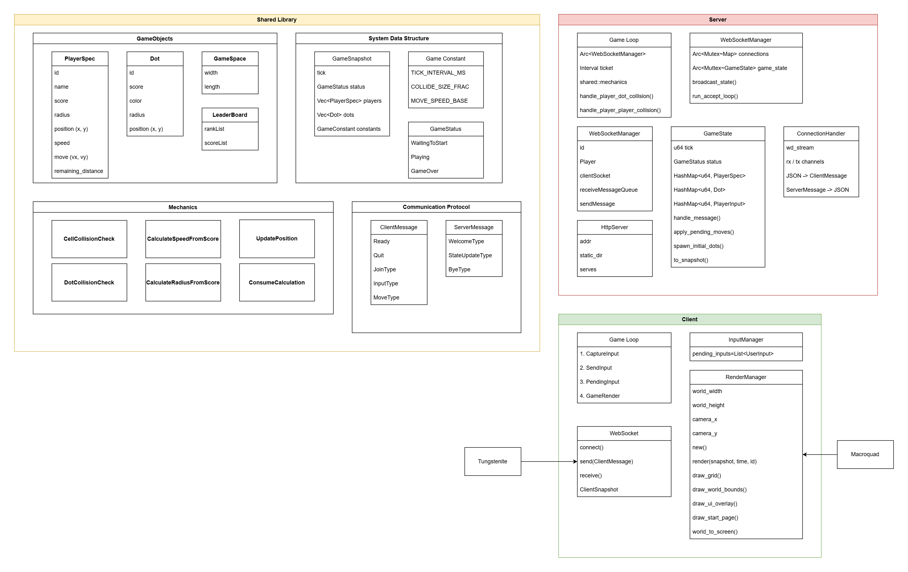
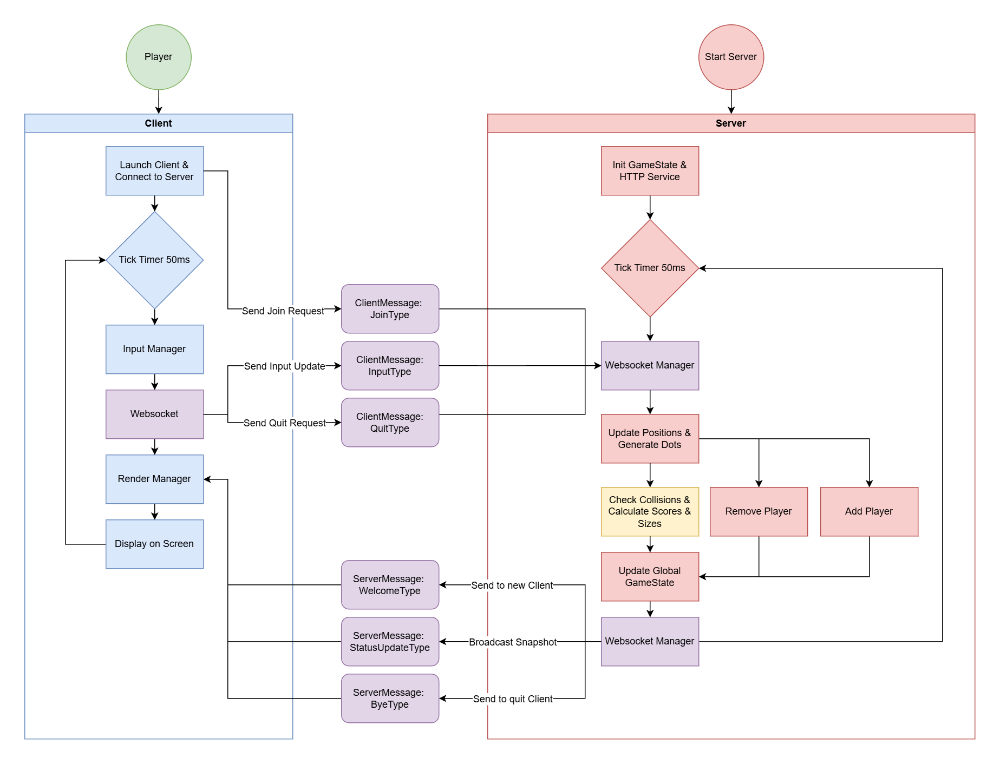

# ECE1724-F1-2025F-Rust-Ball-Ball-U
ECE1724H F1 Special Topics in Software Engineering: Performant Software Systems with Rust 2025 Fall Project

**Course Link:** [Performant Software Systems with Rust][course_page] \
**Project Link:** [BALL BALL U - Home Page][home_page]

## Team Members
| Name                             | Student Number |          Email                  |
|----------------------------------|----------------|---------------------------------|
| [Litao (John) Zhou][github_john] | 1006013092     | litao.zhou@mail.utoronto.ca |
| [Siyu Shao][github_siyu]         | 1007147204     | jasmine.shao@mail.utoronto.ca |
| [Chuyue Zhang][github_chuyue]    | 1005728303     | zhangchuyue.zhang@mail.utoronto.ca |

## Presentation and Demo
**Slide Link:** TBA!!!! \
**Presentation Link:** TBA!!!! \
**Demo Link:** TBA!!!! 

## Introduction 

**Ball Ball U** is a real-time multiplayer PvP(Player versus Player) game inspired by [Battle of Balls][battle_of_balls] and [Agar.io][agar_io], implemented in Rust with a focus on performance, concurrency, and fair competitive gameplay.


## Motivation

Agar.io and Battle of Balls are popular real-time multiplayer games that share the concept that players control balls that grow by consuming smaller balls and scattered food items. Their simple mechanics create deep competitive strategies, making it popular across a wide range of players. 

Our project **Ball Ball U** is inspired by both games, but shifts the focus from PvE-style survival to fast-paced PvP competition. In this version, players directly confront each other, testing both reflexes and strategic decisions such as movement and positioning. This change makes matches more dynamic and competitive, with outcomes driven by player interactions rather than environmental factors. 

We chose Rust because its performance, concurrency model, and memory safety make it well-suited for building a reliable real-time PvP multiplayer game. Although Rust has many existing resources for game development and for backend servers, there are very few complete examples that combine the two into a real-time multiplayer system. Our project helps fill this gap by showing how to connect a Rust game engine with an asynchronous server runtime, providing a clear reference for developers interested in building multiplayer games in Rust.

## Objective

The primary objective of this project is to design and implement a complete, end-to-end, real-time multiplayer game using a pure Rust technology stack.

Inspired by popular titles like Agar.io and Battle of Life, the primary goal is to create a clean, reusable, and well-documented architectural blueprint for client-server interaction within the Rust game development environment.

Our goal is to develop a high-performance, concurrent, and memory-safe multiplayer game server entirely in Rust. This real-time PvP project would include features such as rapid synchronization, consistent state, and low-latency scaling. To support this, we refine mechanics like collision detection, growth rules, and movement dynamics, ensuring fair and engaging encounters.

## Features
The final deliverable of **Ball Ball U** is a real-time, multiplayer online game built entirely in **Rust**, utilising a **client–server architecture**.  
The main features are broken down as follows:

<div align="center">
  <p>
    
  </p>
  <p>
    <em> Figure 1. Project Architecture Diagram </em>
  </p>
</div>

<div align="center">
  <p>
    
  </p>
  <p>
    <em> Figure 2. Project Flow Diagram </em>
  </p>
</div>

### 1. Robust Server Architecture
#### **Asynchronous Concurrency**
- Built on the **tokio** runtime and **tokio-tungstenite**.
- Handles multiple concurrent WebSocket connections asynchronously.
- Scales to many players without blocking threads.

#### **Authoritative Game Loop**
A deterministic **20 Hz tick loop (50ms)** enforces all game mechanics, including:
- Velocity-based movement physics.  
- Collision detection (Player ↔ Player, Player ↔ Dot).  
- Consuming/eating mechanics (dots, players), score updates, radius growth.  
- Player death & respawn logic.

#### **Message Queuing**
- Incoming packets (`ClientMessage`) are deserialized and queued asynchronously.
- Messages are processed *only during the next tick* to preserve order and fairness.

### 2. High-Performance Client

#### **Reactive Rendering Engine**
Uses **macroquad** to render at **60 FPS**, drawing:
- Player cells (unique colours, names).
- Food dots.
- UI overlays (Leaderboard, Timer, Start Menu, Connection status).

#### **Dynamic Camera System**
- Smooth camera tracking centred on the local player.
- Automatically adjusts the viewport as the player moves.

#### **Input Management**
- Captures WASD/Arrow key movement, ESC (quit), Enter (ready).
- Serialises actions into `ClientMessage` packets sent to the server.

#### **State Synchronisation**
Client loop:
- Capture Input → Send Command → Receive Snapshot → Render
- Client updates its state based on authoritative  `ServerMessage::StateUpdate` snapshots.

<div align="center">
  <p>
    
  </p>
  <p>
    <em> Figure 3. Client Interface Screenshot </em>
  </p>
</div>

### 3. Networking & Data Consistency

#### **Shared Protocol Library**
A shared crate ensures both client & server use:
- Identical structs (`PlayerSpec`, `Dot`, `GameSnapshot`, etc.)
- Shared physics constants  
→ Prevents desynchronisation.

#### **JSON Serialisation**
Using **serde** and **serde_json**.

**Client sends:**
- `Join`
- `Move` (direction + sequence number)
- `Ready`
- `Quit`

**Server broadcasts:**
- `Welcome` (initial setup for joining players)
- `StateUpdate` (full world snapshot each tick)
- `Bye` (disconnect notice)

#### **Global Broadcasting**
- Once per tick, the server serialises the full game state.
- Broadcasts via Tx channels to all connected clients.
- Ensures every player receives a synchronised world state.

<div align="center">
  <p>
    
  </p>
  <p>
    <em> Figure 4. 2 Clients have the same leaderboard status screenshot </em>
  </p>
</div>

## User’s and Developer’s Guide

This project is organised into a Rust workspace containing three crates: **server**, **client**, and **shared**.

  * **Shared:** Defines the "source of truth"—protocol messages, game objects (Players, Dots), and physics mechanics.
  * **Server:** Runs the authoritative game simulation, manages WebSocket connections via `tokio-tungstenite`, and serves static files via `hyper`.
  * **Client:** Handles the game loop using `macroquad` for rendering and `tokio` for asynchronous network communication.

### 0\. Workspace Setup

To develop or extend this project, ensure your workspace `Cargo.toml` includes all three members:

```toml
[workspace]
members = ["server", "client", "shared"]
resolver = "2"
```

-----

### 1\. Using the Shared Crate

**Target Audience:** Developers adding new game mechanics or packet types.

The **shared** crate contains the data structures that must remain consistent across the network.

**Example: Creating Protocol Messages and Game Constants**

```rust
extern crate shared;
use shared::protocol::{ClientMessage, UserInput};
use shared::GameConstant;

fn main() {
    // 1. Create a Join message (sent when client connects)
    let join_msg = ClientMessage::Join {
        name: "PlayerOne".to_string(),
    };
    
    // 2. Create a Move message (sent when player presses keys)
    let move_msg = ClientMessage::Move {
        dx: 1.0,
        dy: 0.0,
        distance: 5.0,
    };

    println!("Serialized Protocol Message: {:?}", serde_json::to_string(&join_msg));
    
    // 3. Define Game Constants (used for physics calculations)
    let constants = GameConstant {
        tick_interval_ms: 50,
        collide_size_fraction: 1.1,
        move_speed_base: 150.0,
        dot_radius: 5.0,
    };
}
```

-----

### 2\. Using the Server Crate

**Target Audience:** Developers modifying the backend architecture or hosting the game.

The **server** crate uses the Tokio runtime. It requires initializing the `WebSocketManager` (which holds the game state) and the `GameLoop` (which processes physics).

**Example: Initializing and Running the Server**

```rust
extern crate server;
use std::sync::Arc;
use std::path::PathBuf;
use server::websocket_manager::WebSocketManager;
use server::game_loop::GameLoop;
use server::http_server::HttpServer;

#[tokio::main]
async fn main() {
    // 1. Initialize the WebSocket Manager (handles game state & connections)
    // Note: Bind to 0.0.0.0 to allow external connections
    let ws_manager = Arc::new(WebSocketManager::new("0.0.0.0:34568").await);

    // 2. Initialize the Game Loop (physics engine)
    let game_loop = GameLoop::new(ws_manager.clone());

    // 3. Initialize HTTP Server for static assets (HTML/JS)
    let static_path = PathBuf::from("static");
    let http_server = HttpServer::new("0.0.0.0:34567", static_path);

    // 4. Spawn non-blocking tasks
    let ws_clone = ws_manager.clone();
    tokio::spawn(async move {
        ws_clone.run_accept_loop().await;
    });

    tokio::spawn(async move {
        http_server.run().await;
    });

    println!("Server started. Game loop running...");
    
    // 5. Run the authoritative game loop (this blocks the main thread)
    game_loop.run().await;
}
```

-----

### 3\. Using the Client Crate

**Target Audience:** Developers working on rendering, input handling, or UI.

The **client** crate uses the `macroquad` framework. Unlike standard Rust binaries, the main function is decorated with `#[macroquad::main]`.

**Example: Client Entry Point Structure**

```rust
extern crate client;
use macroquad::prelude::*;
// Note: Actual implementation requires modules defined in client/src/
// This snippet illustrates the architectural flow.

fn window_conf() -> Conf {
    Conf {
        window_title: "Ball Ball U".to_string(),
        window_width: 1280,
        window_height: 720,
        ..Default::default()
    }
}

#[macroquad::main(window_conf)]
async fn main() {
    // 1. Setup Async Runtime for networking
    let rt = tokio::runtime::Runtime::new().unwrap();

    // 2. Initialize Managers
    // (In actual code: RenderManager::new, InputManager::new)
    
    // 3. Connect via WebSocket
    let url = "ws://127.0.0.1:34568";
    println!("Connecting to {}...", url);

    // 4. Main Game Loop (60 FPS default)
    loop {
        // A. Capture Input (WASD / ESC)
        // input_manager.poll_input(...);

        // B. Render Game World based on latest Server Snapshot
        // render_manager.render(snapshot, ...);

        // C. Wait for next frame
        next_frame().await;
    }
}
```

## Reproducibility Guide

To reproduce the build and run the project exactly as intended, follow these steps with no deviation.
These instructions work on both Ubuntu Linux and MacOS.

### 0. Install Rust
```bash
curl --proto '=https' --tlsv1.2 -sSf https://sh.rustup.rs | sh
```

### 1. Git Clone the project
```bash
git clone https://github.com/zlt0518/ECE1724-2025F-Rust-Ball-Ball-U.git
```

### 2. Enter the code workspace within the project
```bash
cd ballballu
```

### 3. Build the entire workspace
```bash
cargo build
```
This compiles all three crates: server, client, and shared.

### 3.1. (Important): Network ports configuration
**The server process opens two TCP ports:**
- An HTTP server for static assets (HTML/JS/CSS) on port <34567>.
- A WebSocket game server for real-time gameplay on port <34568>.

**To run the project successfully:**
- Make sure these two ports (<34567>, <34568>) are not already in use on the machine where you run the server.
- If there is a firewall, allow incoming TCP connections on these ports (at least from the machine running the client).

### 4. Run the server
```bash
cargo run -p server
```
The server will start listening for WebSocket connections and begin running the game loop.

### 4.1. (Optional): Connect From Another Machine Using SSH

If you want to run the server on one machine and the client on another:

On the server machine, find its IP address:
```bash
ip addr
```
or on macOS:
```bash
ifconfig
```

On the second machine, connect via SSH:
```bash
ssh username@SERVER_IP_ADDRESS
```

After connecting, you can run the server or client normally on that machine.

### 5. Run the client

Open a second terminal window (or use a second machine via SSH) and run:
```bash
cargo run -p client
```

The client will automatically connect to the server’s WebSocket endpoint and begin rendering the game.
**You may open multiple client instances (each in its own terminal or via SSH), and as long as they are connected to the same server address, all clients will join the same game world and play together**

### 6. Controls and UI

#### When the client window opens:
- Use [W][A][S][D] or the Arrow Keys to move your ball.
- Keyboard input player nickname.
- Press [Enter] to mark yourself as ready / start the game.
- Press [Esc] to quit the client.

#### The client shows:
- Your own ball (with a unique colour and name).
- Other players’ balls.
- Food dots.
- Basic UI overlays, such as a timer and scores.


## Contributions by each team member
### Siyu Shao
- Implemented input handling and player movement logic in the macroquad client (WASD/Arrow keys, key-down based control, speed scaling with ball size);
- Implemented anonymous user mode with random player naming on the client;
- Implemented and refined client-side leaderboard and control panel UI;
- Implemented and refined client WebSocket handling, including automatic disconnection when the server is killed;
- Debugging and Testing;
- Wrote presentation and report.

### Litao(John) Zhou
- Implemented shared game mechanism library;
- Implemented client skeleton and established communication with server;
- Implemented start page and type naming feature;
- Implemented timer for client;
- Debugging and Testing;
- Wrote presentation and report.

### Chuyue Zhang
- Designed system architecture;
- Implemented server;
- Integrated Macroquad to the client;
- Implemented the mechanism to generate players at random places and generate different types of dots during the game;
- Debugging and Testing;
- Wrote presentation and report.

**IMPORTANT: Several parts of the code were implemented during live debugging and coding sessions, with commits pushed by a single team member.**

## Lesson Learned
Working on **Ball Ball U** let us use Rust in a way that is very different from small homework problems. We had to keep an authoritative game server, a shared-protocol crate, and a real-time client working together. Through this process, we became more comfortable with Rust’s ownership rules, async/await, and WebSocket networking, and we saw how these tools can be combined to support a fast PvP game.

At the same time, the project also showed us several things we would do differently next time. Early on, we spent a lot of time exploring text-based rendering, and only later switched fully to a graphical engine. If we had made this decision earlier, we could have put more effort into gameplay polish and user experience. On the server side, some modules became more complex than we expected, and we learned that agreeing on clear boundaries between networking, game logic, and state management at the design stage would make later changes much easier.

Overall, this project has been a very positive learning experience for our team, both technically and in how we planed and divided work in a longer project. We now have a working real-time multiplayer game written entirely in Rust, with an authoritative server, a graphical client, and a shared protocol that keeps them in synchronization. We believe this project makes a meaningful contribution to the Rust community by providing a concrete blueprint for full-stack, real-time game architecture.

## Conclusion

In conclusion, **Ball Ball U** successfully demonstrates the power of Rust in building a performant, real-time multiplayer game by effectively bridging an authoritative `tokio` server with a `macroquad` client. This project not only delivers a complete PvP experience but also serves as a valuable architectural reference for developers exploring safe concurrency and real-time networking in the Rust ecosystem.

[course_page]: https://www.eecg.toronto.edu/~bli/ece1724
[home_page]: https://github.com/zlt0518/ECE1724-2025F-Rust-Ball-Ball-U
[battle_of_balls]: https://www.battleofballs.com
[agar_io]: https://agar.io
[github_john]: https://github.com/zlt0518
[github_siyu]: https://github.com/jassiyu
[github_chuyue]: https://github.com/IronDumpling

[Tokio-tungstenite]:https://docs.rs/tokio-tungstenite/latest/tokio_tungstenite/
[WebSocket]: https://github.com/snapview/tungstenite-rs
[Serde]: https://serde.rs/

